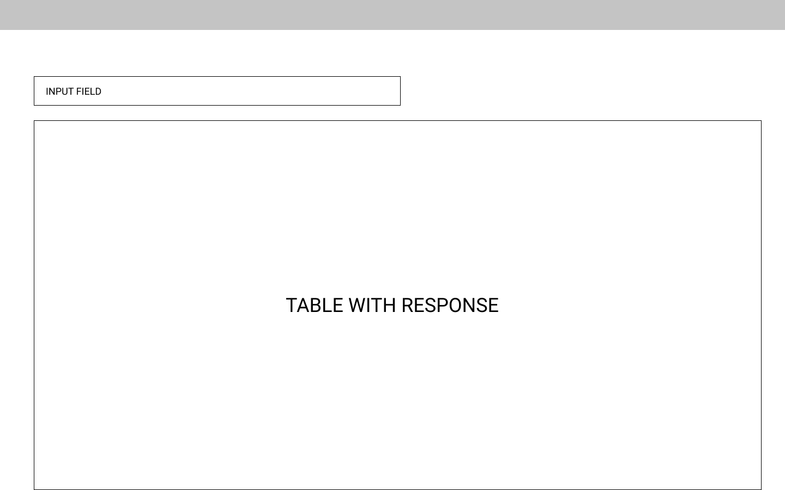

## Pro Arch Front End Code Test

Welcome to the ProArch Coding Test, the aim of this test is to give an overview of your coding capabilities and your mindset to approaching problems. The base for this application was created with `Create React App` and modified to use both TypeScript and SCSS. There were also some slight modifications to get the basic parts in place.

From here on out this is all yours, you can modify the codebase however you see fit. We encourage to use of any libraries to help get to the final result faster.

### The Task

The aim of this task to take the large set of mock data found in the data format, load it in and put that into a table with the ability to filter by company name via a text field.

An example of this can be found in the layout.png file:

How you choose to do that is entirely up to you. We reccomend using off the shelf solutions if you can to aid with UI and data loading.

## Running the Code

To run the code please use Yarn and start it up with `Yarn Start`. For more information about running this please see the `RUNNING.md` document.

## Packaging Up the Code

Once you are done with the code please Zip up the package and return this to us via Email or (WeTransfer if need be). Please ensure you exclude the `node_modules` folder in the final Zip file.
